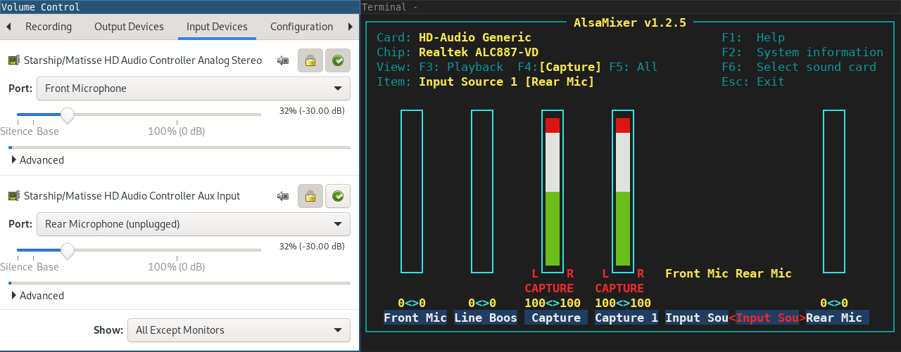

# Screenshot

Detailed caption of screenshot:
Pavucontrol's input tab shows two recordable sources from the same sound card.
One source is set to the front microphone, the other to the rear microphone.
Alsamixer's capture settings panel is shown next to it.
There's two capture inputs, Capture and Capture 1, both enabled.
There's two input sources. One is set to Front Mic, the other to Rear Mic.

# What's all this then?

Do you have a sound card that supports recording from two inputs at once?

Example: Recording from microphone and line in.

Example: https://forum.manjaro.org/t/how-to-separe-ports-into-different-devices-on-pulseaudio/55890

Example: https://unix.stackexchange.com/questions/373122/how-to-split-ports-in-a-source-into-separate-sources-in-pulseaudio

PulseAudio may not expose this to your system, so I've made some profiles to help.

Tested cards:

- Advanced Micro Devices, Inc. [AMD] Starship/Matisse HD Audio Controller (PCI vendor 1022 product 1487)

# Installation

Follow these steps:

1. Run 'sudo install.sh'
2. Check if you now have an extra audio input in PulseAudio

# Tweaking guide

If this code doesn't work, you'll likely need to do some tweaking.
Try these:

## udev

Run lspci -nn and find your audio line like this:

- 0b:00.4 Audio device [0403]: Advanced Micro Devices, Inc. [AMD] Starship/Matisse HD Audio Controller [1022:1487]

The numbers in the brackets at the end are the vendor ID.
Update the rules in the udev directory to match against that.

## pulseaudio profiles

Make sure the 'device-strings' in the profile matches your device.
To find it, do this:

- Run 'arecord -l'
- Note down the device number for the second input
- In the 'device-strings' for analog-stereo-aux, change the '2' to the device number

## pulseaudio paths

The rest of the tweaking is just messing with pulseaudio.
It's not that difficult, look at the existing code in /usr/share/pulseaudio/alsa-mixer/paths/

The code in this repository is basically a subset of those files with 'Capture' and 'Input Source' set to 'Capture,1' and 'Input Source,1' in the various paths, split out to new files, with a new profile that builds on the default.

Just try to match up the names to your sound card, assuming it works the same way.

As a caveat, alsamixer will display human friendly names like 'Capture 1' for its controls.
Run 'amixer' (with an optional --card paramater) to see the true names of the controls.
